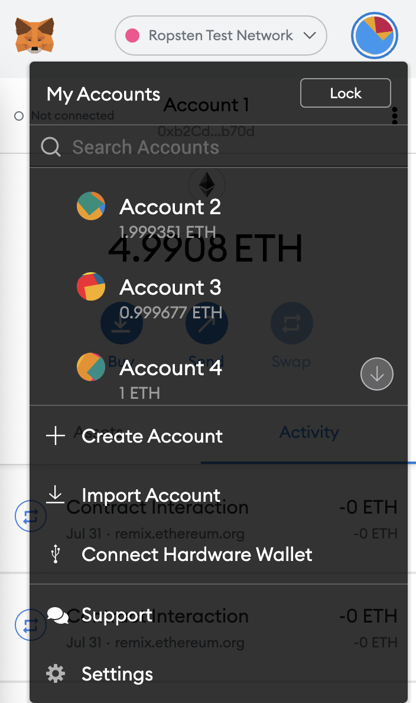
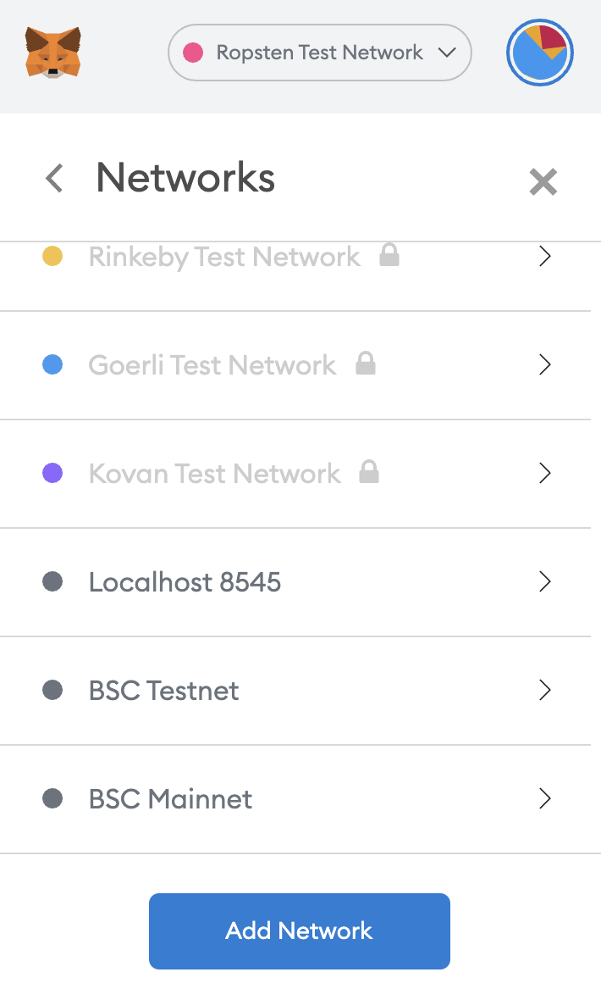
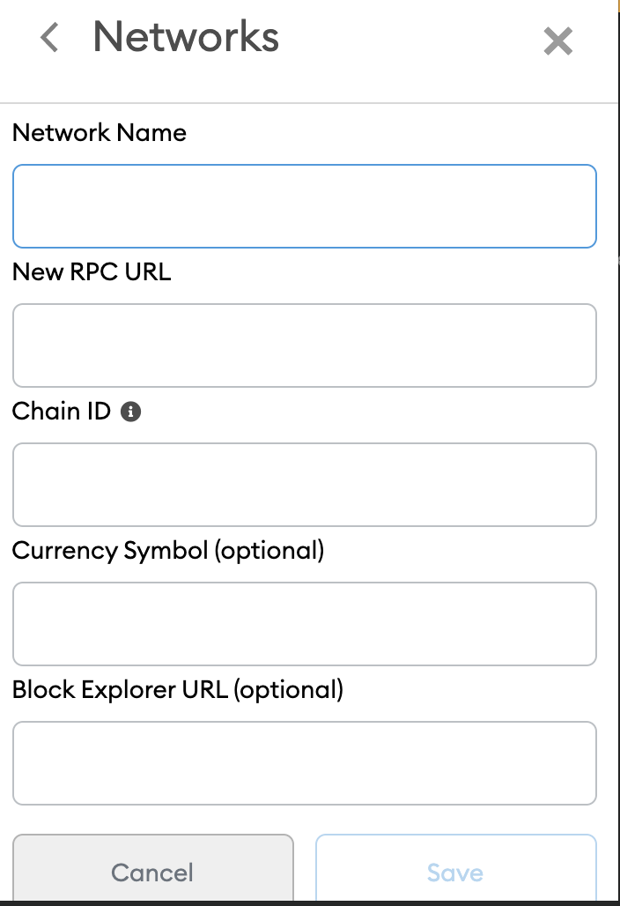
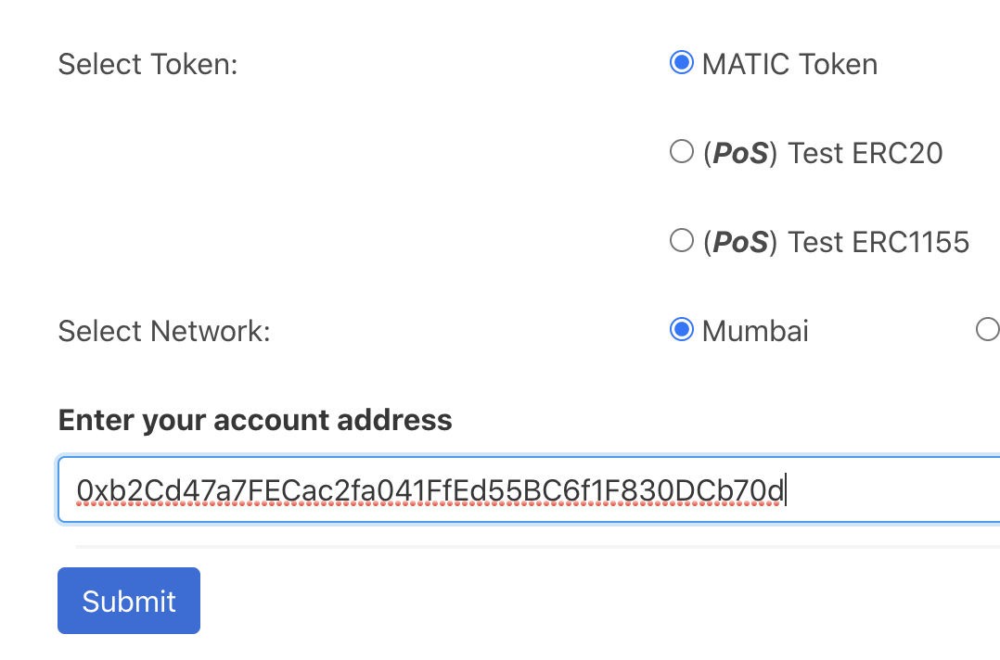
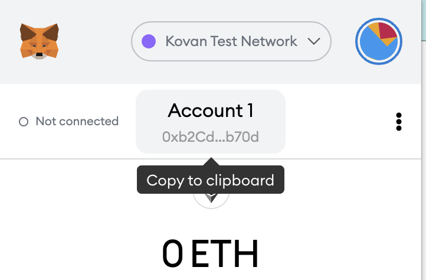
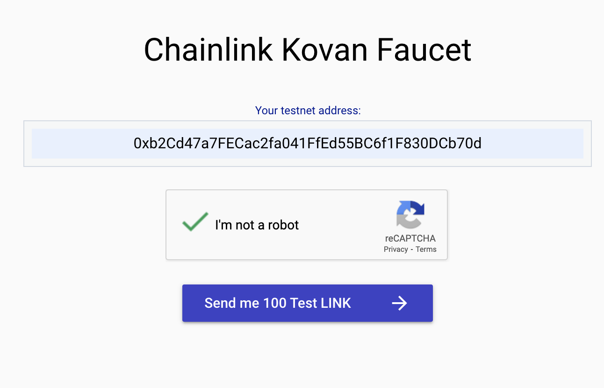
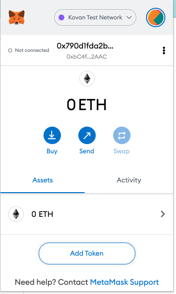
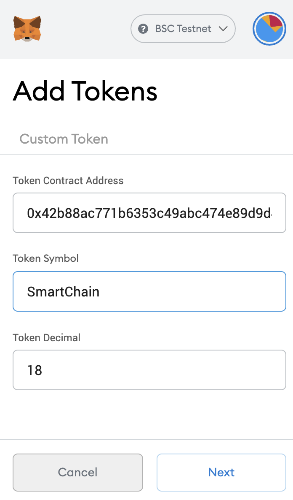
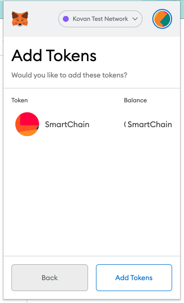

# Smartchain.bet
- Be the “go-to” and leader P2P-Betting Dapp in the Market
- Create a Blockchain-Smart Contract based platform that supports a multitude of options for peer-to-peer betting
- Universal Bet Support – Provide users with different ways of betting (e.g. score, spread, who scores first, etc.)
- Universal Bet Wager – Bets could be not only on Sports events (e.g. how much it is going to rain in NYC today?)

Fee Split

- Ethereum Kovan
- Address 0xaFC200be05fAAbE86fcC3ccd2d98169eF2611C36

- Polygon Mainnet
- Address 0x1288fb58ce7b3daf4e5a3fce2039fd23f8733105

Link Data Feeds can be used from these Networks

### Polygon Mainnet
- ETH_CHAIN_ID 137
- Address `0xb0897686c545045afc77cf20ec7a532e3120e0f1`
- Name ChainLink Token
- Symbol LINK
- Decimals 18

### Ethereum Kovan
- ETH_CHAIN ID 42
- Address `0xa36085F69e2889c224210F603D836748e7dC0088` 
- Name ChainLink Token
- Symbol LINK
- Decimals 18

**Kovan Faucets**
- Testnet LINK is available from [https://kovan.chain.link/]
- Testnet ETH is available from [https://linkfaucet.protofire.io/kovan]

## Connect Your MetaMask with MATIC Polygon Mainnet

Before we get started create a MetaMask Wallet or import One, then follow the steps:

1. Go to setting page

2. Select Networks and click on `Add Network`

3. Fill the fields with this information

- Testnet

    - RPC URLs - Use RPC URLs Testnet (Mumbai) from https://docs.matic.network/docs/develop/network-details/network/
    - ChainID: 80001
    - Symbol: MATIC
    - Block Explorer: Use Block Explorer Testnet (Mumbai) from https://docs.matic.network/docs/develop/network-details/network/

4. Claim some testnet token to your account Click on your address for copy
faucet (use Mumbai MATIC) https://faucet.matic.network/

5. Go to faucet page: [https://testnet.], then paste your address in the box and click on “Give me ...”

`Tip`   Please note that you have to refresh the page to cpy new accoutn address

## Connect Your MetaMask with ETH Kovan

Before we get started create a MetaMask Wallet or import One, then follow the steps:

1. Select Kovan Test in your MetaMask wallet

2. Claim some testnet token to your account, click on your address for copy

3. Go to Chainlink Kovan Faucet page: [https://kovan.chain.link/], then paste your address in the box and click on “Send me 100 Test LINK”

`Tip`   Please note that you can only claim once every 24 hours until next allowance

## Adding a Token to your Wallet

1. Copy "Ctl+C" the Smart Address of your contract, for example: `0x732D6B1d3c733975E20470E385723B2b017D9dB6` that is in Kovan Testnet, then Go to your wallet and select `Assets` and click on `Add Token`

3. Paste the address on `Token Contract Address`, Type "SmartChain" in Token Symbol  and click on Next button. 

4. Now you have the Token Added to your Wallet

...

